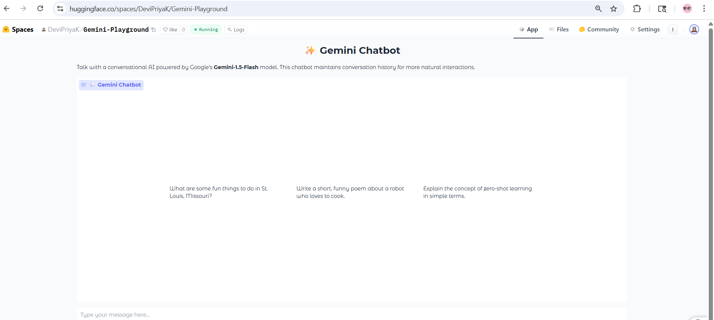

Check out the configuration reference at https://huggingface.co/docs/hub/spaces-config-reference

---

🚀 [Try the Gemini Chatbot on Hugging Face Spaces](https://huggingface.co/spaces/DeviPriyaK/Gemini-Playground)

<!-- Optional: Add a screenshot below -->
<!--  -->

<!-- For Hugging Face README only: -->
<!-- <iframe src="https://huggingface.co/spaces/DeviPriyaK/Gemini-Playground?embed=true" width="850" height="450"></iframe> -->